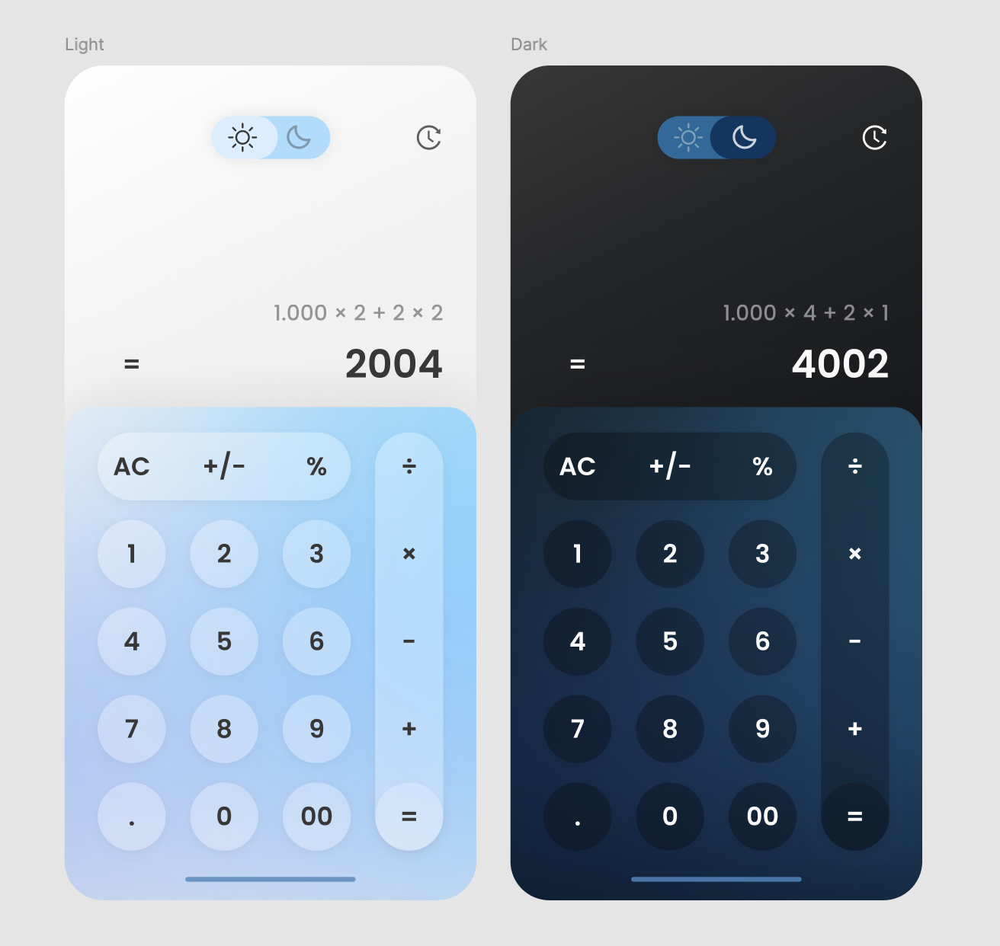
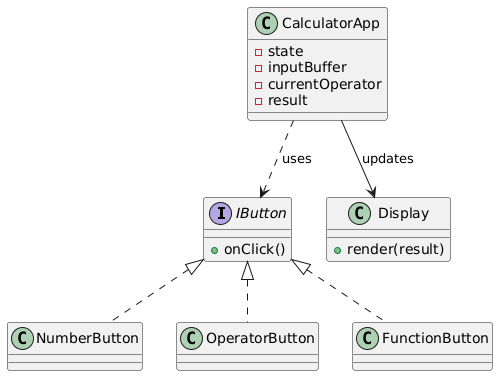
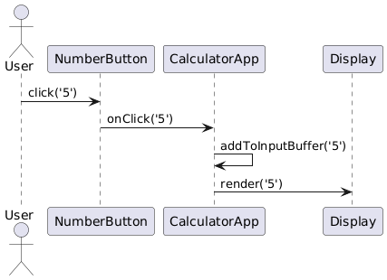
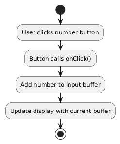

# Calculator Project

A simple calculator application built with [JavaScript / TypeScript / React] (choose your tech stack) that supports basic arithmetic operations.

---

## Table of Contents

- [Features](#features)
- [Demo](#demo)
- [Screenshots](#screenshots)
- [Installation](#installation)
- [Prototype Preview](#prototype-preview)
- [UML Component Diagram](#uml-component-diagram)
- [UML Sequence Diagram](#uml-sequence-diagram)
- [Flowchart](#flowchart)
- [Project Structure](#project-structure)
- [Testing](#testing)

---

## Features

- Basic arithmetic: addition, subtraction, multiplication, division
- Clear (C) and equals (=) functionality
- Responsive design for desktop and mobile
- User-friendly interface with button feedback

---

## Demo

Add a link to live demo here (e.g., GitHub Pages or Vercel)  
[https://your-demo-link.com](https://your-demo-link.com)

---

## Screenshots

  


---

## Installation

1. Clone the repo
   ```bash
   git clone https://github.com/yanabkv/calculator-js.git
   cd calculator-js
   npm install
   npm start
   ```
## Prototype Preview

<a href="https://www.figma.com/design/D9Prw2vNJUYqLITiGIY60A/Calculator--Community-?node-id=0-1&t=BUN0SDXq24o3FCWA-1"></a>

## UML Component Diagram



## UML Sequence Diagram



## Flowchart



I created diagrams using https://plantuml.com/

## Project structure
```
calculator-app/
├── public/           # Static files (HTML, images)
├── src/              # Source code
│   ├── components/   # UI components (Buttons, Display)
│   ├── styles/       # CSS or SCSS files
│   ├── App.js        # Main application logic
│   └── index.js      # Entry point
├── tests/            # Unit and integration tests
├── README.md         # Project documentation
├── package.json      # Project metadata and scripts
└── .gitignore        # Files to ignore in Git
```

## Testing

I used jest for unit tests
